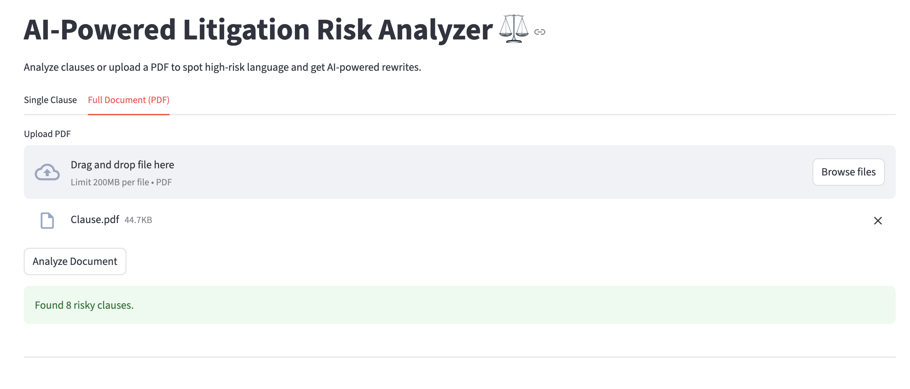
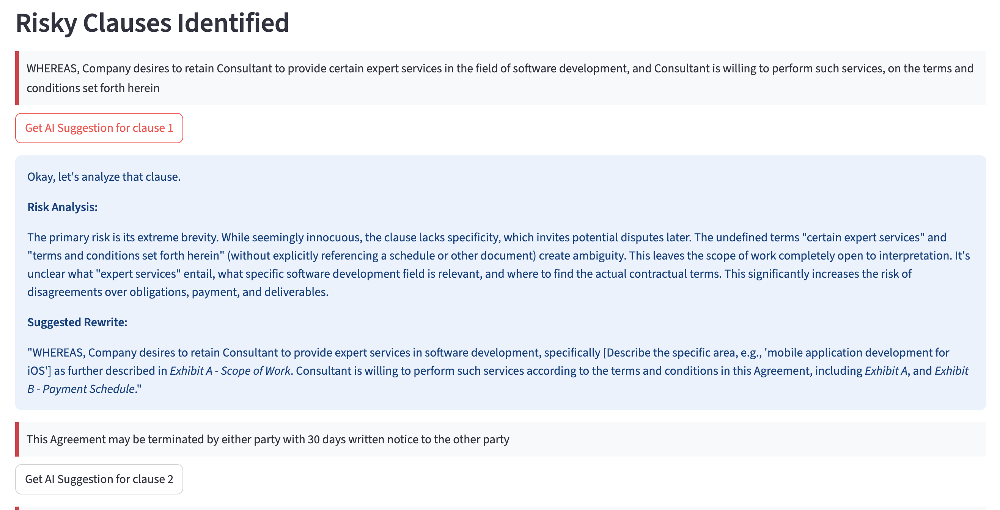

# ⚖️ AI-Powered Litigation Risk Analyzer

An end-to-end web application that leverages **Natural Language Processing (NLP)** and **Generative AI** to analyze legal contract clauses, predict their potential litigation risk, and provide AI-powered suggestions for improvement.

### Screenshots




---

## ✨ Key Features

- **Risk Classification** — analyzes contract clauses and classifies them as High, Medium, or Low litigation risk using a fine-tuned ML model
- **Full Document Analysis** — upload a complete contract in PDF format to automatically extract text and surface the top 10 riskiest clauses
- **AI-Powered Suggestions** — uses the Google Gemini API to generate concise, expert-level risk analyses and suggested rewrites for high- and medium-risk clauses
- **Interactive UI** — a clean Streamlit interface with separate workflows for single-clause and full-document analysis
- **MLOps Architecture** — a modular pipeline for data ingestion, transformation, and model training, structured for maintainability and reuse

---

## 🛠️ Technology Stack

| Layer | Tools |
|---|---|
| Backend | Flask |
| Frontend | Streamlit |
| Machine Learning | LightGBM, Scikit-learn |
| NLP & Embeddings | Sentence-Transformers (`legal-bert-base-uncased`) |
| Generative AI | Google Gemini API |
| Data Handling | Pandas, NumPy |
| PDF Processing | PyPDF2 |
| Containerization | Docker |

---

## 🚀 Setup and Installation

**1. Clone the repository**

```bash
git clone https://github.com/Satyam999999/LegalMind-Intelligent-Risk-Analyzer.git
cd litigation-risk-analyzer
```

**2. Create a virtual environment**

```bash
python -m venv venv
source venv/bin/activate      # Windows: venv\Scripts\activate
```

**3. Install dependencies**

```bash
pip install -r requirements.txt
```

**4. Set up your API key**

Create a `.env` file in the project root and add:

```env
GEMINI_API_KEY="YOUR_API_KEY_HERE"
```

**5. Download the dataset**

- Download the [CUAD v1 dataset](https://www.atticusprojectai.org/cuad) from The Atticus Project
- Create a `data/` folder in the project root
- Place `master_clauses.csv` inside `data/`

**6. Run the training pipeline** *(one-time step — processes the data and trains the model, producing artifacts in `artifacts/`)*

```bash
python src/pipeline/training_pipeline.py
```

**7. Run the application**

```bash
streamlit run app.py
```

The app will be available at **http://localhost:8501**.

---

## ⚠️ Disclaimer

This tool is intended to assist with preliminary contract review and should not replace professional legal advice. Risk assessments and AI-generated suggestions should be independently verified by a qualified attorney.
